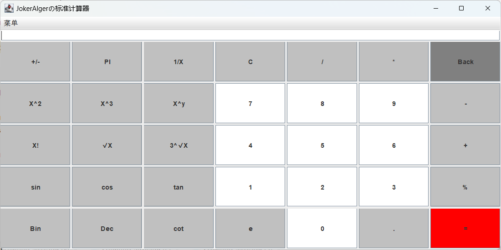

#  Java科学计算器

##### 这是一个简单的科学计算器，基于Java Swing构建。该计算器具有标准和科学两种模式，并支持基本的数学和位运算操作。实现基本的加、减、乘、除运算，以及表达式计算（加减乘除括号负号）；二、八、十、十六进制间的相互转化，带符号的左移右移；逻辑与或非异或的运算；（左右移、逻辑运算和表达式计算有问题，待修复）

##### 其他功能：开方、求倒数、化百分数、求平方、 求立方、求x的y次方、求阶乘、取余、取整（取小数点之前的）、求常用对数、求三角函数；

##### PS:此项目在[everglow0/Java-Calculator](https://github.com/everglow0/Java-Calculator)项目基础上修改

## 功能

### 基本计算功能

- 加法（+）
- 减法（-）
- 乘法（*）
- 除法（/）
- 指数运算（X^y）

### 科学计算功能

- 正弦（sin）
- 余弦（cos）
- 正切（tan）
- 余切（cot）
- 平方根（√X）
- 立方根（3^√X）
- 倒数（1/X）
- 平方（X^2）
- 阶乘（X!）
- 百分比（%）
- 自然对数底（e）
- 圆周率（PI）

### 位运算功能

- 左移（<<）
- 右移（>>）
- 按位与（AND）
- 按位或（OR）
- 按位非（NOT）
- 按位异或（XOR）

### 进制转换

- 十进制（DEC）
- 二进制（Bin）
- 八进制（Oct）
- 十六进制（Hex）

## 使用说明

1. **标准计算器和科学计算器切换**
   - 在菜单栏中选择“菜单” -> “标准计算器”或“科学计算器”以切换计算器模式。
2. **基本计算**
   - 输入数字和运算符进行基本数学运算。
   - 使用等号（=）获取结果。
3. **科学计算**
   - 使用科学计算按钮执行高级数学函数和操作。
   - 支持常用的三角函数、平方根、指数运算等。
4. **位运算**
   - 使用位运算按钮执行按位运算，包括左移、右移、按位与、按位或、按位非、按位异或。
5. **进制转换**
   - 选择相应的进制按钮（DEC、Bin、Oct、Hex）进行数字的进制转换。
6. **错误处理**
   - 当出现除零错误或其他非法操作时，计算器将显示错误消息。

## 示例

1. **基本计算**
   - 输入 `2 + 3 =` 将显示结果 `5`。
2. **科学计算**
   - 输入 `sin(30) =` 将显示正弦值 `0.5`。
3. **位运算**
   - 输入 `5 AND 3 =` 将显示按位与的结果 `1`。
4. **进制转换**
   - 输入 `DEC 15`，然后点击 `Bin` 将显示二进制表示 `1111`。

## 注意事项

- 在使用位运算和进制转换功能时，请确保输入为整数。
- 当进行科学计算时，确保输入的值和操作符的组合是合法的。

## 版本历史

- 版本 1.0
  - 初始版本，包括基本计算、科学计算、位运算和进制转换功能。

标准计算器界面

科学计算器界面

